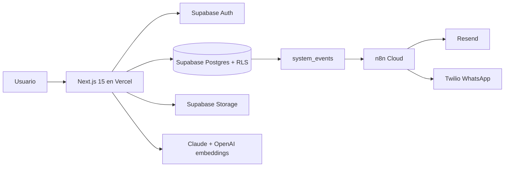

# Arquitectura

## Decisiones clave

- Supabase concentra Auth, Postgres, Storage, Edge Functions y RLS para reducir superficie operativa en Fase 1.
- Mastra se limita al modulo de contratos porque ahi si hay varios agentes con responsabilidades distintas.
- Los modulos no se importan entre si; usan `shared-*` o eventos en `system_events`.

## Agregar un modulo

1. Crear `packages/modules/<nuevo>`.
2. Agregar tablas con `workspace_id` y politicas RLS.
3. Publicar eventos en `system_events`.
4. Crear ruta UI en `apps/web/app/(app)/<nuevo>`.
5. Agregar tests unitarios y fixtures.
