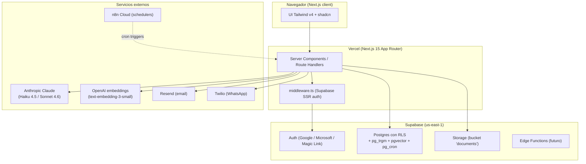

# Arquitectura

## Diagrama lógico

## Capas

### `apps/web` — única app desplegada

Single Next.js 15 app. Toda UI + API en App Router.

- **Server Components** para todo lo que lea datos (dashboard, listas).
- **Route Handlers** (`app/api/**/route.ts`) para uploads y reconciliación.
- **Middleware** corre Supabase SSR para refrescar sesión en cada request.

### `packages/shared-*` — utilitarios cross-módulo

| Package                     | Responsabilidad                                          |
|-----------------------------|----------------------------------------------------------|
| `@jvp/shared-db`            | Cliente Supabase tipado (server/browser/middleware), tipos compartidos |
| `@jvp/shared-auth`          | `getSession()`, `requireAppSession()`, RBAC helpers       |
| `@jvp/shared-agents`        | Cliente Claude unificado con retries + embeddings OpenAI |
| `@jvp/shared-ui`            | `cn()` + theming + componentes (`ComplianceBadge`, etc.) |
| `@jvp/shared-notifications` | Wrappers de Resend y Twilio                              |

### `packages/modules/*` — lógica de negocio aislada

Regla absoluta: **un módulo nunca importa otro**. Solo dependen de `shared-*`. Si necesitan comunicarse, escriben/leen `system_events`.

| Módulo               | Estado            | Mastra | Modelo LLM principal |
|----------------------|-------------------|--------|----------------------|
| `module-cfdi`        | ✅ Implementado    | No     | Haiku 4.5             |
| `module-laboral`     | 🚧 Schema + stub  | No     | Haiku 4.5 (visión PDF) |
| `module-contratos`   | 🚧 Schema + stub  | Sí     | Haiku 4.5 + Sonnet 4.6 |

## Multi-tenancy

- **Workspaces**: entidad tenant. Cada user nuevo crea su workspace en signup (via trigger SQL `handle_new_user`).
- **Memberships**: tabla `workspace_members` con roles (`owner`, `admin`, `analyst`, `viewer`). Determina permisos de write.
- **Active workspace**: cookie `active_workspace_id`. El switcher (pendiente impl. UI) lo cambia.
- **RLS**: toda tabla tiene `workspace_id` + policies que verifican membresía via funciones `is_workspace_member()` y `can_write_workspace()`.
- **Platform admin**: usuario con `profiles.is_platform_admin = true` (asignado automáticamente si su email coincide con `app.platform_admin_email` setting). Atraviesa todas las RLS y accede a `/admin`.

## Modularidad — ¿cómo agregar un módulo nuevo?

1. Crear `packages/modules/<nombre>/` con `package.json`, `tsconfig.json`, `src/`.
2. Agregar nueva migración `supabase/migrations/YYYYMMDDHHmmss_module_<nombre>.sql` con tablas, RLS y `module` enum value si aplica.
3. Crear páginas `apps/web/app/<nombre>/page.tsx`.
4. Agregar entry en `apps/web/components/shell.tsx` `NAV`.
5. Si necesita scheduler, agregar workflow JSON en `workflows/n8n/` o función pg_cron.
6. Escribir `README.md` con el scope.

**Nunca** importar el módulo desde otro. Comunicación inter-módulo solo vía `system_events`.

## Decisiones clave

Ver carpeta [DECISIONS/](DECISIONS/) para los ADRs:

- [001 — Monorepo con Turborepo + pnpm](DECISIONS/001-monorepo-turborepo.md)
- [002 — Supabase vs Azure en Fase 1](DECISIONS/002-supabase-vs-azure-phase1.md)
- [003 — Claude Haiku 4.5 como modelo default](DECISIONS/003-claude-haiku-default-model.md)
- [004 — Mastra solo en módulo Contratos](DECISIONS/004-mastra-only-for-contracts.md)
- [005 — Multi-tenancy con workspaces (no organizations)](DECISIONS/005-multi-tenancy-with-workspaces.md)
